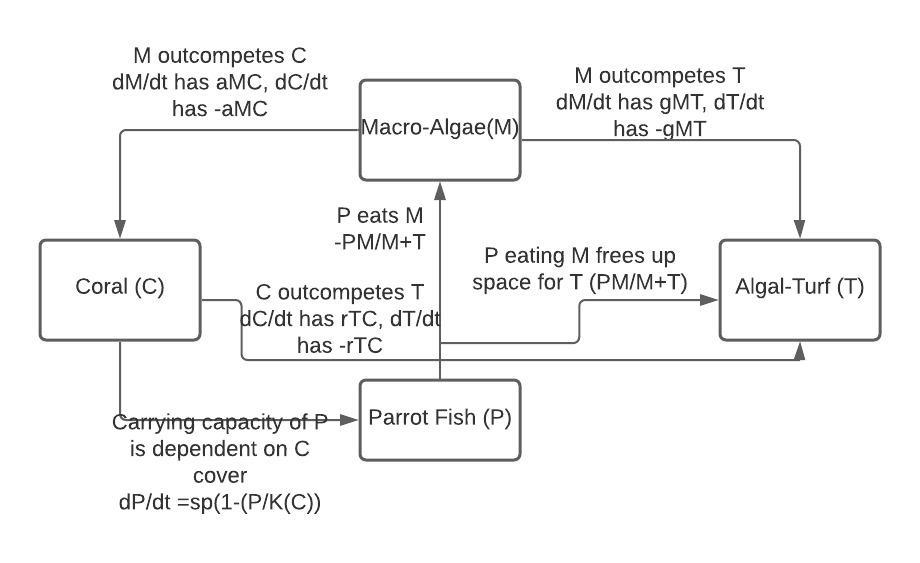

```{r setup, include=FALSE}
knitr::opts_chunk$set(echo = TRUE)
```
# Question 1


# Question 2
Group Flow Diagram: 


# Question 3
Flow Diagram: 

Parameters: 

* a represents competition between macro-algae and coral. 
* g represents competition between macro-algae and turf
* r represents competition between turf and coral
* d represents some death parameter for coral 


```{r echo=FALSE}
require(deSolve)

# Initial values
state <- c(M=10,P=10,T=10,C=10)
times <- seq(0,100,by=0.1)


# Parameters
parameters <- c(a = 0.1,g=0.8,r=1.0,d=0.44,s=0.49,K=10)


# Model
coral_model <- function(t,state,parameters){
  with(as.list(c(state,parameters)),{
    dM <- (a*M*C) -((P*M)/(M + T))+ (g*M*T)
    dC <- (r*T*C)-(d*C)-(a*M*C)
    dT <- ((P*M)/(M + T))-(g*M*T)-(r*T*C)+(d*C)
    dP <- (s*P)*(1-(P/K))
    list(c(dM,dC,dT,dP))   
  })}
```


```{r}
# Model and plot results
out <- ode(y = state,times=times,func=coral_model,parms=parameters)
plot(out,ylab='N',xlab='time',las=1, xlim=c(0,10))
```


```{r}
parameters <- c(a = 0.2,g=0.8,r=1.0,d=0.44,s=0.49,K=10) #Parameter a increased by .1
out <- ode(y = state,times=times,func=coral_model,parms=parameters)
plot(out,ylab='N',xlab='time',las=1, xlim=c(0,10))

```

We found that changes in parameter a resulted in the largest effect on coral populations, as increases in a, which is the competition between macro-algae and coral, resulted in coral population (N) declining faster. 


# Part B


# Question 6 

The social-focused group (consisting of Ray and Paulina) explained that their models mostly focused on whether conservationists were recruited or not based on societal norms, sensitivity to fishing and the available coral cover. They found that coral cover was one of the most important factors, as decreasing coral cover when other parameters stayed the same had the largest effect and saw increases in rates of new conservationists.

# Question 7


# Question 8
As a group, we discussed the integration of both models and predicted that changes in the fishing rates and changes in coral cover would have the largest effect on the system. 

# Question 9 and 10
```{r}

# From Thampi et al. 2018 paper https://www.nature.com/articles/s41598-018-20341-0#Sec6

require(deSolve)
coupled_model <- function(Time, State, Pars) {
  with(as.list(c(State, Pars)), {
    dM <-  a*M*C - (P*M)/(M+T) + gamma*M*T
    dC <-  r*T*C - d*C - a*M*C
    dT <- (P*M)/(M+T) - gamma*M*T - r*T*C + d*C
    dP <- s*P*(1 - P/C) - sigma*P*(1 - X)
    dX <- kappa*X*(1 - X)*(-1 + j*(1 - C) - sigma*P*(1 - X) + phi*(2*X - 1))
    return(list(c(dM,dC,dT,dP,dX)))  
  })
}

pars <- c(a = 0.1, gamma = 0.8, r = 1.0, d = 0.2, s = 0.49, sigma = 0.5, kappa= 1.014, j=1.5, phi = 0.5)
#Gamma and d 
#Decreases in sigma (fishing rate) reduced macro-algae cover due to increased parrotfish, and increased coral cover and turf. 

yini  <- c(M = 0.05, C = 0.9, T = 0.05, P = 0.4, X = 0.5)
times <- seq(0, 100, by = 0.1)
out   <- ode(yini, times, coupled_model, pars)
plot(out, ylab="N", xlab="time")
```

We found that the most important parameters are gamma, d, and sigma, which makes some intuitive sense as changes in gamma and d resulted in shifts in competition between macro-algae, turf, and coral-if macro-algae was for some reason starting to be out-competed by the other two species, that would have widespread effects on available coral coverage and turf. The same can be said if the d parameter for coral changed, giving coral a greater advantage over macro-algae and turf. These changes also reduced the recruitment of new conservationists, which also makes sense, as the corals are quite healthy in this scenario and there is no urgent need to increase the amount of conservation efforts. Decreases in sigma, which is the fishing rates, reduced macro-algae cover due to increased populations of parrotfish that act as top-down control mechanisms, resulting in indirect increases to coral cover and turf. 

# Part C

11. Our predictions about the coupled socio-ecological systems lined up fairly well with what we saw in the model but also surprised us, as coral health and competition was an important factor in both of our models, and we assumed that coral's competition for space would still be a strong predictor, and decreases in coral cover would result in increased recruitment of new conservationists in response to its deterioration. We did not however predict that the fishing rates would also have a very large effect on the system, and we only realized afterwards just how much of an effect the top-down control of the parrotfish had on the system. 

12. Our flow diagrams didn't change very much, as the basic structure of it stayed the same, but as we discussed more and met with the social group, found more and more aspects of it that we needed to add to it that made it more complex. I learned to acknowledge the importance of societal factors in systems and that they must be accounted for when thinking about ecological processes, as humans almost always have some impact on the system. 

13. I think one limitation that was in the coupled model was that the actual effect of human impacts seemed pretty simple and generalized, as parameters such as sensitivity to norms of society seemed unclear in terms of how to actually develop a value like that. Also, the model doesn't really take into account other human factors that could affect the system, like governmental regulations like MPA's or protected fisheries that might have an effect on fishing rates. I think adding those to the model are important, but I also recognize that there's a certain point where you have to stop trying to include all of the factors that you think might be important for the sake of simplicity and ease of testing. 

14. I think that it would be useful to have a few more points in this assignment where we all come together and discuss our findings- both to get new ideas but also to make sure that everyone's on the same page and have the correct answers, otherwise some misunderstanding in the beginning stages of the exercise might carry over, and then sharing these ideas might lead more people astray. 


